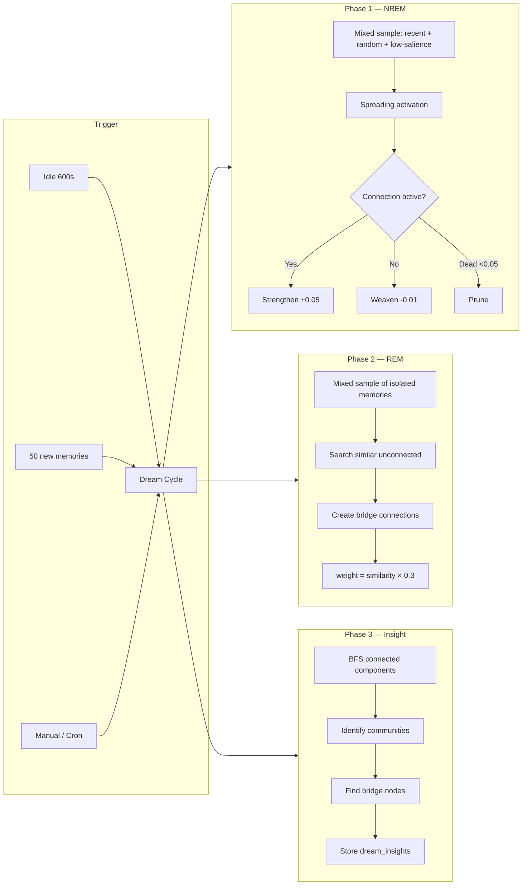

# Mazemaker Adapter for Hermes Agents and any MCP-compatible system

> **Give your AI a memory that actually sticks.**
> One install, and your assistant remembers across sessions — not just what you said, but how the pieces fit together.


---

## In one minute

You know how AI assistants forget everything between chats? This fixes that.

Plug it in, and your assistant gets a brain that:

- 📌 **Remembers what you tell it** — preferences, decisions, fixes, the path of that file you mentioned three weeks ago.
- 🧠 **Connects related ideas** — like a real notebook with cross-references, not a search box.
- 😴 **Reflects while you sleep** — overnight, it strengthens what matters and notices new connections.
- ✏️ **Updates itself when you change your mind** — old facts get superseded, not duplicated.

That's it. The rest of this README goes deeper the further you scroll.

> **🌀 Don't want to install anything?** Managed hosted endpoint at
> **[api.mazemaker.dev](https://api.mazemaker.dev)** with the operator console at
> **[mazemaker.dev](https://mazemaker.dev)** and the marketing surface at
> **[mazemaker.online](https://mazemaker.online)** — *Build the maze. Your agent finds the way.*
> Sign up, point your agent at the MCP endpoint, done.

---

## 🚀 Official Beta — 2026-05-19

> **Free for the entire beta.** No credit card, no quota gate, no "trial" countdown.
> Self-host the community engine forever under AGPLv3, or take the managed Pro stack
> while we burn the launch budget. We'll tell you well in advance when billing turns on.

The cognition stack went from **three layers to six.** The audit-grade v8
LongMemEval-S R@5 = 0.9787 number stands. On top of it, a 100-iteration
benchmark-driven engineering loop crossed every internal stretch target on
the harder full-corpus oracle harness:

| Headline metric                           | iter00 anchor | **iter100 champion** | Δ          |
|-------------------------------------------|:-------------:|:--------------------:|:----------:|
| R@5  (LongMemEval-oracle 500q, full corpus) | 0.6851       | **0.8426**           | **+15.75 pp** |
| R@10                                       | 0.7383        | **0.9000**           | **+16.17 pp** |
| R@1                                        | 0.5000        | **0.6255**           | **+12.55 pp** |
| MRR                                        | 0.5777        | **0.7124**           | **+13.47 pp** |
| ssu R@10 (single-session-user)             | 0.7344        | **1.0000**           | **+26.56 pp** |

The full 1.6 GB claim-evidence bundle (pg_dump of the oracle corpus + every
iteration's JSON + the 8-round v8 audit transcripts) is downloadable from
[ProtonDrive](https://drive.proton.me/urls/J2T53B95XC#gtbM3E2mTvjt) ·
SHA-256 `263e2494…`. Run the same numbers on your machine end-to-end.

### What shipped between v8 and beta — six layers, in order

1. **Sponge ingestion** *(community)* — turn-by-turn absorption + session-end
   atomic fact extraction. Conflict detection at write time.
2. **Atomic Fact Extraction (AFE)** *(Pro)* — four-stage formation pipeline.
   Stage A (markdown structure) · Stage B (spaCy NER) · Stage C (one local
   LLM call per session, sub-1B model, user-state focused — `user prefers X`,
   `user owns Y`) · Stage S (synthesis crystallization during dream).
   **Bulk-write refactor: 88 min → 75 s per 500 sources, a 70× speedup.**
3. **Embedding — semantic + late-interaction + graph-aware** *(community: BGE-M3
   + ColBERT; Pro: + DAE)*. ColBERT@1.5 stays load-bearing (-13 pp R@5 without
   it). DAE (Dream-Augmented Embeddings) — second embedding built during NREM
   that weights toward graph neighbours — now wired through PostgresStore end
   to end (was silently disabled on PG until 2026-05-14).
4. **Three-phase dream consolidation** *(community: NREM; Pro: + REM + Insight)*
   — GPU-accelerated. NREM Personalized PageRank ran ~38 s for a 193 k-corpus
   full cycle on RTX-class CUDA (down from "never finished" on CPU). REM bulk
   bridge writes via single staged transaction. Insight clusters via Louvain
   over the consolidated graph.
5. **Synthesis crystallization (Stage S)** *(Pro)* — selective LLM-distilled
   memory formation. ~10 % yield by design — the dilution dance is real and
   bounded.
6. **Targeted re-formation** *(Pro)* — the lever that broke the R@5 = 0.7404
   retrieval-tuning ceiling. Identify per-question-type gold sessions that
   aren't in top-5, surgical query-conditional Stage C rebake on just those
   sessions. ~$0.07 in API spend lifted ssp R@5 0.3667 → 0.7000 (+33 pp),
   ssu R@5 0.6406 → 0.9375 (+30 pp), tr R@5 0.6535 → 0.7874 (+13 pp).

The community engine ships layers 1, 3 (partial), and 4. The full six-layer
stack — the one that ran the 100-iteration loop to R@5 = 0.8426 — ships on
the managed Pro tier.

### Introducing the Inception Bench

The most important thing we shipped this cycle isn't an engine improvement,
it's a benchmark methodology. **The published memory benchmarks we tested
against had a measured ~50 % rubric-defect rate on update-tracking items
and a ~20 % defect rate on BEAM-10M conv-1.** External LLM judges drift by
**16 percentage points on identical answers** depending on which judge you
pick. We documented every failure mode (transcripts in
[`benchmarks/audit/`](benchmarks/audit/)) and then we did the only thing
that makes sense after you watch your scoreboard rot in real time: we
inception'd the benchmark.

**Inception Benchmarking** is the discipline we now ship as
[`benchmarks/mazemaker_memory_bench.py`](benchmarks/mazemaker_memory_bench.py):

- **One file. 12 deterministic scenarios. No LLM in the scoring loop.**
- Score is `label in [r["label"] for r in top_k]`. Substring + unit-aware
  match against a canonical gold string. Deterministic. Reproducible
  bit-for-bit.
- Scenarios include needle-in-100k-haystack (R@1 = 1.000 on 100,010-fact
  corpus), conflict-fuse, distractor-resistance, negation, multi-fact
  retrieval, latency at 10k, and a dream-ablation control arm.
- Macro mean: R@1 = 0.888 / R@5 = 0.924 / R@10 = 0.972.
- Failure modes are documented, not hidden — S9 graph-traversal still
  scores R@1 = 0.000 and we say so.

Run it yourself in 60 seconds:

```bash
git clone https://github.com/itsXactlY/mazemaker && cd mazemaker
pip install -r requirements.txt
python benchmarks/mazemaker_memory_bench.py
```

The blog post [Inception Benchmarking — the benchmark that did not exist](https://mazemaker.online/blog/inception-benchmarking/)
walks through every external rubric defect we found, every judge calibration
spread we measured, and why the only honest path forward is to publish your
own scorer alongside your own engine.

### Engineering deliverables — non-exhaustive, since v8

- **Postgres + pgvector** is now the primary backend for Pro/Enterprise.
  `MM_DB_BACKEND=postgres` flips it; the community SQLite-WAL path stays.
- **Atomic Fact Extraction bulk-write** — 70× speedup, single bulk embed +
  `executemany` INSERT, single commit per cycle.
- **DAE end-to-end wiring** — read path (`PostgresStore.fetch_dae_vectors`)
  + compute path (`dae_bulk_compute` is now store-agnostic) + cadence knob
  (`_dae_recompute_every`, default 5).
- **GPU dream cycle** — full 193 k-corpus cycle in ~38 s. NREM PPR via
  `torch.sparse.mm` + `topk` on GPU. REM batched recall + bulk bridge writes.
  CPU fallback automatic for non-CUDA installs.
- **REM FK guard** — `add_bridges_batch` anti-joins against `memories` on
  both endpoints. NREM can prune mid-cycle without aborting the whole REM
  phase. (`bug:rem-fk-violation-stale-gpu-ids`, patched 2026-05-17.)
- **`prune_orphans` rewritten** as NOT EXISTS — 10 min hang → milliseconds on
  the same 333 k-memory corpus.
- **Embed-server collision fix** — `MM_EMBED_SOCK_PATH` env var documented;
  bench orchestrators run convs sequentially by default.
- **Inception Bench corpus** — single `pg_restore`, four BEAM scales plus the
  full LongMemEval triplet, SHA-256-provenanced. 957 MB snapshot, ~3 s
  restore. The blog post
  [The Mazemaker bench corpus now lives in Postgres](https://mazemaker.online/blog/why-our-bench-corpus-now-lives-in-postgres/)
  has the full migration story.

### Beyond the engine — the surrounding surface

- **The Architect cockpit** — [architect.mazemaker.dev](https://architect.mazemaker.dev/),
  a 12-monitor SPA inspired by *The Matrix Reloaded*. Hosted UI, local data
  (loopback to your pod), zero compromise. Read the
  [page-deep-dive](https://mazemaker.online/architect/).
- **Hermes Skill Indexing** — one button in the Architect indexes every
  Hermes skill (~230 on a typical operator install) as a memory with
  `skill:<source>:<name>` label. Public-prefix gate in `wonderland/daemon.py`
  skips AES so the embedding stays semantically searchable.
- **Four-domain topology** — `mazemaker.online` (marketing + install) ·
  `mazemaker.dev` (passkey dev console + `mzm-*` API keys) ·
  `api.mazemaker.dev` (Hetzner-backed license/onboard, never sees memory
  content) · `architect.mazemaker.dev` (the cockpit SPA). Memory data never
  crosses the network. The [topology page](https://mazemaker.online/topology/)
  has the request-flow diagram and the data-segregation table.
- **Onboarding deep-dive** — the
  [onboarding page](https://mazemaker.online/onboarding/) walks the install
  one-liner through ten idempotent stages (pre-flight → fingerprint init →
  browser handoff → license JWT → embedding choice → Quadlet render →
  pod boot → health check).
- **The 1.6 GB reproducibility bundle** — restorable `pg_dump` + 100-iter
  JSONs + 8-round audit transcripts + bench-loop logs.
  [ProtonDrive link](https://drive.proton.me/urls/J2T53B95XC#gtbM3E2mTvjt) ·
  SHA-256 `263e2494…`.

### Bench-noise discipline (read before citing any number)

godbench R@5 has ±0.5 pp run-to-run noise at n=500. ssp at n=30 has
3.3 pp per-question granularity. Real wins require either a delta clearly
above the noise band or multi-iteration replication. iter34/35/37/38 all
hit ssp R@5 = 0.3667 — that's a real signal because it appeared four
times. Single-run outliers shouldn't anchor "best" claims.

External judge attribution is mandatory: the same 442 mm_10m_eval answers
read 0.36 (nano), 0.49 (Opus), 0.53 (Haiku), or 0.64 (gpt-5.4-mini)
depending on judge. If you see a memory-benchmark number without judge
attribution, treat it as decoration.

---

## Get it running

> **TL;DR.** Easiest path is the one-line managed install — it sets up
> the full Pro stack (ColBERT@1.5, REM + Insight dream phases, the
> Architect UI, dream-worker autonomy, Postgres) and is **free during
> launch** with no credit card. Self-hosting works, is fully
> open-source, but ships a deliberately lighter feature set; see the
> tier table below.

```bash
# One-line managed install — Pro stack, free during launch.  Sets up
# rootless Podman pods, the four containers, and wires up every
# MCP-speaking tool the script detects.  Requires the onboarding
# wizard (browser opens itself).
curl -fsSL https://api.mazemaker.dev/install.sh | bash

# OR self-host the community engine directly:
git clone https://github.com/itsXactlY/mazemaker
cd mazemaker
pip install -r requirements.txt
bash install.sh          # auto-detect hermes-agent
bash install.sh /path    # explicit path
```

The managed installer figures out: Python deps, GPU detection, plugin
deployment, DB init at `~/.mazemaker/engine/memory.db`, the four pod
containers, the `~/.mazemaker/license.jwt` license key.

Restart hermes after install: `hermes gateway restart`.

### Community vs. Pro feature matrix

The engine source is dual-licensed under AGPLv3 + PolyForm-NC.  Every
feature is in this repo and every gate is a plain `if has_feature()`
call you can grep for in [`python/license.py`](python/license.py).
The community build is real and useful — it produces the published
R@5 = 0.96 LongMemEval-S hybrid number — but the headline
differentiators ship in the Pro tier.

| Feature                          | Community (no license) | Pro / Enterprise |
|----------------------------------|:----------------------:|:----------------:|
| Hybrid recall (BM25 + dense)     | ✅                     | ✅               |
| LongMemEval-S R@5 = 0.96         | ✅                     | ✅               |
| NREM dream consolidation         | ✅                     | ✅               |
| SQLite WAL backend               | ✅                     | ✅               |
| MCP server + CLI                 | ✅                     | ✅               |
| Hop-2 graph reasoning (R@10=1.0) | ✅                     | ✅               |
| Conflict supersession            | ✅                     | ✅               |
| **ColBERT@1.5 late-interaction** | ❌                     | ✅ → R@5 = 0.98  |
| **REM dream phase** (bridges)    | ❌                     | ✅               |
| **Insight dream phase** (clusters)| ❌                    | ✅               |
| **Autonomous dream-worker**      | ❌                     | ✅               |
| **Architect UI** (visual graph)  | ❌                     | ✅               |
| **Postgres + pgvector backend**  | ❌                     | ✅               |
| One-line installer + auto-update | ❌                     | ✅               |
| Operator-direct email support    | ❌                     | ✅               |

The community build runs the same engine with the Pro features gated
off.  No booby-traps, no anti-features — every gate is open-source and
inspectable.  License-key verification lives in `python/license.py`
(Ed25519-signed JWTs); see [mazemaker.online/#pricing](https://mazemaker.online/#pricing)
for tier details.

That's the beginner path. If anything goes wrong, the [Production Lessons](#production-lessons) section near the bottom has every gotcha I've seen on a clean VM.

**Live Dashboard — Knowledge Graph**

[](https://raw.githubusercontent.com/itsXactlY/mazemaker/refs/heads/master/assets/mazemaker_dashboard.png)

---

## Why it's different from "ChatGPT memory"

Most AI memory systems are search engines: type a query, get back the few documents that contain the same words. That works for simple recall. It falls apart for everything else an agent actually needs.

| Need                                                           | Search-engine memory | This system |
|----------------------------------------------------------------|----------------------|-------------|
| Find a fact you told it once                                   | ✅                   | ✅          |
| Follow a chain of reasoning across multiple memories           | ❌                   | ✅          |
| Notice that two related facts should be connected              | ❌                   | ✅          |
| Replace a stale fact when you tell it the new one              | ❌                   | ✅          |
| Hold its ground when irrelevant noise piles up                 | ❌                   | ✅          |
| Tell you *why* it surfaced a particular memory                 | ❌                   | ✅          |

The right mental model isn't "vector database." It's **a small brain that lives next to your agent.**

If you want the numbers behind those check marks, keep scrolling. If you don't, the install above is enough — defaults are good.

---

## The numbers

A vector database with cosine similarity will do the first row of the table below well and fail every other row. We measured that explicitly, with negative controls (shuffled edges, supersession off, pre-dream zero) that *must* fail when the relevant mechanism is disabled.

### Internal benchmark suite — capability lifts

| Capability                                                          | Vanilla cosine          | Mazemaker           | Lift               |
|---------------------------------------------------------------------|-------------------------|---------------------|--------------------|
| Hop-2 graph reasoning (answer reachable only via A→B→C edges)      | **0.00** R@10            | **1.00** R@10       | **+1.00**          |
| Real edges vs shuffled control (proves traversal, not embedding)    | n/a                     | 1.00 → 0.27         | **+0.73 collapse** |
| Post-dream synthesis (facts inferable only after consolidation)     | structurally **0.00**   | **0.43** at scale   | **+0.43 lift**     |
| Conflict supersession (winner@1 with `detect_conflicts=False`)      | 0.03 control            | **0.33**            | **+0.30**          |
| Cross-session continuity under concept-mode distractors             | **0.06**                | **0.62**            | **+0.56**          |
| Lean retrieval mode (real prose, n=200) vs default skynet           | n/a                     | **0.60** vs 0.42    | **+0.18 R@5**      |

R@10 = "the right answer is in the top-10 results", scored 0..1. Higher is better.
Full numbers, the JSON dumps, and the suite catalog: [`benchmarks/README.md`](benchmarks/README.md).

> **Beta — May 2026.** The headline numbers in this section come from the
> v8 audit (per-question ephemeral harness). They still stand. The harder
> full-corpus oracle harness, plus the new Inception Bench results from
> the 100-iteration loop, are at the
> [top of this README](#-official-beta--2026-05-19).
> The two harness families measure different things — see
> [`invariant:godbench-vs-v8-harness-mismatch`](#) below before
> comparing the numbers side-by-side.

### Public benchmark numbers — LongMemEval-S 500-question retrieval

External, third-party benchmark from Wu et al. (ICLR 2025). 470 gradeable questions out of 500. Same harness, same dataset, same config (`recall_mode=hybrid, k=10, granularity=session`); only the ColBERT@1.5 late-interaction channel differs.

| Metric | hybrid baseline | hybrid + ColBERT@1.5 | Δ |
|---|---|---|---|
| **R@1** | 0.8064 | **0.8574** | **+5.10 pp** |
| **R@5** | 0.9596 | **0.9787** | **+1.91 pp** |
| **R@10** | 0.9830 | **0.9894** | +0.64 pp |
| **MRR** | 0.8733 | **0.9114** | **+3.81 pp** |
| p50 latency | 41.1 ms | 56.9 ms | +15.8 ms |

ColBERT@1.5 lifts **three of six question types to perfect R@5** (knowledge-update, multi-session, single-session-assistant) and gives the largest single-category swing on **single-session-user (+7.8 pp R@5, +10.4 pp MRR)**. Reproducible through the harness in [`benchmarks/external/longmemeval_s.py`](benchmarks/external/longmemeval_s.py); the canonical result JSONs are checked in alongside.

### Public benchmark numbers — Comparison Bench

Head-to-head against the ten small/medium open-source models that an external memory-benchmark vendor publishes as scoring 0/N because the models couldn't follow the required JSON output schema. We score plain-text answers via substring match. No JSON gating.

| Run | Aggregate | Errors | Notes |
|---|---|---|---|
| no-ColBERT | 186/200 = **93.0%** | 2 | hybrid + rerank + advanced |
| **ColBERT@1.5 (fixed)** | **188/200 = 94.0%** | **0** | reproducibility-fix verified |

`gemma3:270m` — Google's smallest production-deployed LLM (270M parameters, runs on a Raspberry Pi) — scores 18/20 = 90% in both conditions. Reproducible by curl: `bash <(curl -fsSL https://mazemaker.dev/bench.sh)`. Harness + canonical JSONs in [`benchmarks/external/`](benchmarks/external/README.md).

---

## How we proved it (the audit story)

A peer-review-grade benchmark for this kind of system **didn't exist**. Existing semantic-memory evaluations measure either retrieval (BEIR, MS MARCO) or QA (NaturalQuestions) — none of them test graph traversal, dream consolidation, or supersession.

So we built one, and had it independently audited by **GPT-5.5** (via [codex CLI](https://openai.com/codex)). It pushed back hard. Eight rounds:

| Round | Verdict                                | Headline reason                                                                  |
|-------|----------------------------------------|----------------------------------------------------------------------------------|
| v2    | **no**                                 | Lexical leakage in queries; broken dream suite; no baseline                      |
| v3    | **no**                                 | Topic-word leakage; cross-instance anchor collisions; wrong-class import         |
| v4    | qualified-y                            | Source-level fixes pending verification                                          |
| v5    | **YES** + 4 caveats                    | Every condition empirically satisfied                                            |
| v6    | qualified-y w/ 4 caveats               | Real-text mode + lean preset shipped; 4 follow-ups                               |
| v7    | qualified-y w/ 1 caveat                | n=200 real-prose: lean **beats** default skynet by +0.18 R@5                     |
| **v8**| **UNCONDITIONAL YES — no residual caveat** | Dream lift +0.43 at scale; the +0.04 at v7 was a sample-size artifact        |

Every prompt and every verdict, from "no, this is just lexical retrieval" to "unconditional yes — accept it as evidence", is committed verbatim under [`benchmarks/audit/`](benchmarks/audit/). Open `codex-v2-audit-2026-04-28.md` and `codex-v8-verdict-2026-04-28.md` side by side to see the journey end-to-end.

---

## What the benchmark *gave back* to the production code

Running the benchmark wasn't just measurement. It surfaced real engineering wins. Each one is now a documented, opt-in option in `~/.hermes/config.yaml`:

- **`retrieval_mode: lean`** — channel ablation proved that on real prose, BM25 / temporal / salience are dead-weight (or actively *harmful*). Lean drops them. Result: **4× faster than skynet on synthetic; +0.18 R@5 better than skynet on real prose**. The benchmark told the production code which channels to remove.
- **`recall_score_percentile`** — the legacy `score_floor` operates on a badly-scaled internal score (~0..0.05); a sensible-looking value like 0.2 silently nukes everything. The new percentile knob is calibrated [0,1] by *rank*, so `0.5` keeps top half regardless of corpus or model.
- **PPR is the load-bearing channel for ranking** (-0.13 MRR if removed); semantic is the load-bearing channel for recall (-0.26 if removed). Surface this in your config tuning.
- **`MM_COLBERT_ENABLED=1` is the precision-mode opt-in** — pre-computes a per-memory top-32 token cache (~64 KB/row, ~14.7 GB across a 230k-memory corpus), unlocks the late-interaction rerank channel, and on LongMemEval-S 500q lifts R@1 +5.10 pp / MRR +3.81 pp. Three of six question types reach perfect R@5. Default-off so existing latency budgets stay intact.

Run the benchmark yourself:

```bash
# Full v8 run on real-text corpus (200 chunks from the project's own docs):
python -m benchmarks.mazemaker_benchmark.runner \
  --realistic --suite baseline --suite lean_skynet \
  --suite graph_reasoning --suite dream_derived_fact \
  --suite conflict_quality --suite continuity_controls \
  --suite channel_ablation \
  --output-dir benchmarks/results/my-run --seed 42

# Single-suite quick check (graph reasoning is the headline):
python -m benchmarks.mazemaker_benchmark.runner \
  --paraphrase --suite graph_reasoning
```

A full run takes ~12 minutes on a workstation. Every suite produces a JSON file under `benchmarks/results/<your-dir>/results/`.

---

## Features (technical bullets)

If the install + the cheat sheet above is enough for you, you can stop reading here. Below this line everything gets progressively more technical.

- **Semantic memory storage** — auto-embed via FastEmbed ONNX (intfloat/multilingual-e5-large, 1024d). Falls back to sentence-transformers, then TF-IDF, then hash.
- **Knowledge graph** — auto-connect related memories by cosine threshold, plus explicit `add_connection()` for typed edges. Canonical (source<target) orientation enforced everywhere.
- **Spreading activation** — BFS or Personalized PageRank for `think(start_id)`. The only path that solves hop-2 retrieval; vanilla cosine literally cannot.
- **Dream Engine** — three-phase autonomous consolidation: NREM (strengthen activated edges + prune weak), REM (bridge isolated memories), Insight (Louvain communities + materialise `derived:cluster` summary memories).
- **Conflict detection + supersession** — fuse-or-mark with revision history. `detect_conflicts=False` control arm proves the algorithm is doing real work, not just relying on recency.
- **Multi-channel retrieval** — semantic + BM25 + entity + temporal + PPR + optional ColBERT late-interaction, fused via Reciprocal Rank Fusion. Six presets (`semantic`, `hybrid`, `advanced`, `skynet`, `lean`, `trim`).
- **ColBERT-style late-interaction rerank** — opt-in 2nd-stage channel via `MM_COLBERT_ENABLED=1`. BGE-M3 emits per-token contextual embeddings; we cache the top-32 per memory in a `colbert_tokens` BLOB and rescore the top-100 fused candidates with max-sim. On LongMemEval-S 500q: R@1 +5.10 pp, R@5 +1.91 pp, MRR +3.81 pp at +15.8 ms p50 latency.
- **GPU recall** — CUDA-accelerated cosine over an in-memory matrix (~100ms for 10k memories). CPU fallback automatic.
- **SQLite-first** — always works, no external DB needed. WAL mode + bg checkpointing. **Postgres + pgvector optional** for shared multi-agent / Pro-tier deployments (set `MM_DB_BACKEND=postgres`).
- **Hermes plugin / MCP server / standalone library** — one core, three integration shapes.

---

## Architecture

### Embedding Backends (auto-priority)

| Priority | Backend | Model | Speed | Requirements |
|----------|---------|-------|-------|--------------|
| 1st | FastEmbed | intfloat/multilingual-e5-large | ~50ms | `pip install fastembed` |
| 2nd | sentence-transformers | BAAI/bge-m3 1024d | ~200ms | GPU recommended |
| 3rd | tfidf | — | varies | numpy only |
| 4th | hash | — | instant | nothing |

FastEmbed uses ONNX runtime — no PyTorch conflict, works on CPU. Falls back automatically.

### GPU Recall Engine

```python
# gpu_recall.py — CUDA cosine similarity
# Loads all embeddings into GPU, does torch.matmul for batch similarity
# ~100ms for 10K memories vs ~500ms CPU

from gpu_recall import GPURecall
engine = GPURecall()
results = engine.recall(query_embedding, all_embeddings, top_k=10)
```

Auto-detects CUDA. Falls back to Python/numpy if no GPU.

### Data Flow

```mermaid
flowchart TD
    subgraph Store["mazemaker_remember"]
        A[User content] --> B[FastEmbed encode]
        B --> C[1024d vector]
        C --> D[SQLite INSERT]
        C --> E[Cosine similarity search]
        E --> F[Create connections]
    end

    subgraph Recall["mazemaker_recall"]
        G[User query] --> H[FastEmbed encode]
        H --> I{CUDA available?}
        I -->|Yes| J[GPU torch.matmul]
        I -->|No| K[CPU numpy dot]
        J --> L[Top-k results]
        K --> L
    end

    subgraph Think["mazemaker_think"]
        M[Source memory] --> N[BFS on connections]
        N --> O[Apply decay factor]
        O --> P[Ranked activation]
    end

    subgraph Dream["mazemaker_dream"]
        Q[Idle trigger] --> R[NREM replay]
        R --> S[REM bridge discovery]
        S --> T[Insight communities]
        T --> U[Consolidated graph]
    end
```



### Storage

- **SQLite (always)**: `~/.mazemaker/engine/memory.db` — source of truth
- **Embeddings cache**: `~/.mazemaker/engine/models/` (auto-downloaded, ~2.2 GB)
- **GPU cache**: `~/.mazemaker/engine/gpu_cache/` (embeddings.npy + metadata.pkl)
- **Access logs**: `~/.mazemaker/engine/access_logs/` (JSON Lines)
- **Postgres + pgvector (optional)**: enabled via `MM_DB_BACKEND=postgres` — graph/cold-storage mirror for shared multi-agent deployments

### SQLite Schema

```sql
-- Core tables
memories (id, content, embedding, category, salience, ...)
connections (source_id, target_id, weight, edge_type)
connection_history (source_id, target_id, last_weight, last_updated)

-- Dream engine
dream_sessions (id, phase, started_at, completed_at, stats)
dream_insights (id, session_id, type, data)

-- Indexes
idx_memories_category ON memories(category)
idx_connections_source ON connections(source_id)
idx_connections_target ON connections(target_id)
```

---

## Configuration (every knob)

All settings in `~/.hermes/config.yaml`. The defaults below are the recommended preset based on the v8 benchmark.

```yaml
memory:
  provider: neural
  neural:
    db_path: ~/.mazemaker/engine/memory.db
    embedding_backend: fastembed       # auto | fastembed | sentence-transformers | tfidf | hash

    # 2026-04-28 benchmark recommended preset.
    # `lean` beat `skynet` by +0.18 R@5 / +0.16 MRR on real prose at n=200,
    # and is 4× faster on synthetic at -0.02 recall. Drops the channels
    # (BM25, temporal, salience) that channel_ablation proved actively
    # hurt recall on real text.
    retrieval_mode: lean               # semantic | hybrid | advanced | skynet | lean | trim
    retrieval_candidates: 128
    use_hnsw: auto                     # ANN index above ~1k memories
    think_engine: ppr                  # bfs | ppr — PPR is the load-bearing channel for ranking

    # Calibrated [0,1] noise floor — drops the bottom X fraction of
    # ranked candidates by RANK. Calibrated alternative to the legacy
    # recall_score_floor (which lived on the badly-scaled raw RRF
    # score ~0..0.05; values >= 0.2 silently nuke everything).
    recall_score_percentile: 0.3

    # Optional: MMR diversity in result set (0.0=pure relevance,
    # 0.7=balanced). Off by default.
    mmr_lambda: 0.0

    # Hermes session knobs
    prefetch_limit: 10
    search_limit: 50
    consolidation_interval: 0
    session_extract_facts: true
    session_fact_limit: 5

    dream:
      enabled: true
      idle_threshold: 600              # seconds before dream cycle
      memory_threshold: 50             # dream after N new memories
    # To enable the Postgres + pgvector mirror, set MM_DB_BACKEND=postgres
    # and supply MM_POSTGRES_DSN (or the discrete MM_POSTGRES_* vars).
```

### Retrieval-mode cheat sheet

| Mode       | Channels active                            | Use when                                     |
|------------|--------------------------------------------|----------------------------------------------|
| `semantic` | semantic only                              | Lowest latency, no hybrid fusion needed      |
| `hybrid`   | semantic + BM25                            | Add lexical recall                           |
| `advanced` | semantic + BM25 + entity                   | + named-entity grounding                     |
| `skynet`   | all six channels                           | Default; over-channeled per benchmark        |
| **`lean`** | semantic + entity + PPR                    | **Recommended** — drops dead-weight channels |
| `trim`     | semantic + BM25 + entity + temporal + PPR  | Conservative middle-ground (drops only salience) |

---

## Tools (LLM-callable surface)

Nine MCP tools. Four are surfaced through the Hermes plugin schema; the rest live on the full Memory class and the daemon path.

| Tool | Description | Surface |
|------|-------------|---------|
| `mazemaker_remember` | Store a memory (with conflict detection) | Core MCP |
| `mazemaker_recall` | Search memories; multi-channel fusion (semantic + BM25 + entity + temporal + PPR + ColBERT) | Core MCP |
| `mazemaker_think` | Spreading activation from a memory; BFS or PPR | Core MCP |
| `mazemaker_graph` | View knowledge graph statistics | Core MCP |
| `mazemaker_stats` | Engine vitals — memory count, edges, embedding fingerprint, compute device | Core MCP |
| `mazemaker_quota` | Live quota state — calls remaining today/month, tier, budget | Core MCP |
| `mazemaker_dream` | Force a dream cycle (all / nrem / rem / insight) | Memory class |
| `mazemaker_dream_stats` | Dream engine telemetry — sessions, phase outcomes, insights | Memory class |
| `mazemaker_prune` | Targeted forgetting by id, label glob, or age (with import-grace marker) | Memory class |

---

## Dream Engine (deep dive)

Autonomous background memory consolidation, biological-sleep inspired:



### Triggers

- Automatic: after 600s idle (configurable)
- Automatic: every 50 new memories (configurable)
- Manual: `mazemaker_dream` tool
- Standalone: `python python/dream_worker.py --daemon`

### Standalone daemon — `dream_worker.py`

When the in-pod dream loop fights with `mazemaker_remember` writers
for the SQLite lock (typical on 100k+ memory pods), pull the dream
loop OUT of the pod and run it as its own process:

```fish
# 1. Disable in-pod engine for this session (ephemeral — clears on reboot)
systemctl --user edit --runtime mazemaker-mcp.service
# add:  [Service]
#       Environment="MM_DREAM_DISABLED=1"
systemctl --user daemon-reload && systemctl --user restart mazemaker-mcp.service

# 2. Run the standalone daemon — same DB, same tables, no idle gating
cd ~/projects/mazemaker/python
python dream_worker.py --max-memories 2000 --max-isolated 800
```

The daemon loops `_run_dream_cycle()` continuously without `should_dream`
checks. GPU is used automatically when `embedding_backend=auto`
detects CUDA. After a reboot the `/run` drop-in is cleared and the
in-pod engine re-enables on its own.

### Sampling

NREM and REM don't pull `LIMIT N ORDER BY created_at DESC` anymore. On a
large corpus that recycles the same recent surface forever — old
memories never get replayed and quietly decay below the prune
threshold. Both phases now sample via a three-slice mix:

- **50%** most recent (created_at DESC)
- **30%** random across the entire `memories` table
- **20%** lowest-salience (the candidates most likely to get pruned next cycle)

The random slice is what breaks the surface trap — every memory has a
non-zero replay chance every cycle regardless of age. Defaults:
`max_memories_per_cycle=2000` (NREM), `max_isolated_per_cycle=800`
(REM). Tunable via `DreamEngine` constructor args. Insight is
unchanged — it already operates on the full edge graph.

### GPU acceleration

When CUDA is available (`GpuRecallEngine` loaded), every CPU-bypassable
hot path moves to the GPU:

- **NREM** — `Mazemaker.think_ids()` runs Personalized PageRank as a
  series of sparse mat-vec multiplies on a row-stochastic adjacency
  tensor cached on CUDA. Top-k happens on the GPU before any transfer
  back, so only ~k ints cross the bus per call. Dict + label
  resolution are skipped — NREM only feeds IDs into the
  activated-edges set. Adjacency cache is reused across cycles
  (rebuilt every 10th NREM by default) so REM's bridge-adds don't
  trigger repeated full uploads.
- **REM** — `recall_batch(queries, k)` collapses 800 sequential
  per-query embed-server round-trips into one `embed_batch` call,
  one matmul `(B, dim) × (dim, N_corpus).T`, one `topk` along the
  batch axis. Bridge writes batch into a single SQL transaction
  via `add_bridges_batch` (one commit instead of ~6000).
- **Insight** — already global, transitively benefits from a richer
  edge graph after batched REM.

End-to-end cycle time on a 193k-memory / ~1M-edge corpus, RTX-class
CUDA, default knobs: **~38s** (NREM ~16s + REM ~12s + Insight ~2s
+ overhead). Pre-GPU baseline never finished a cycle on the same
corpus before the next idle re-trigger fired.

CPU paths remain as fallbacks — non-CUDA installs see no behaviour
change beyond raw speed.

---

## Testing

### Smoke Test (Quick)

```bash
cd ~/projects/mazemaker/python
python3 demo.py
```

### Full Test Suite

```bash
# Plugin test suite
cd ~/.hermes/hermes-agent/plugins/memory/neural
python3 test_suite.py

# Upside-Down Test Suite — edge cases, corruption, concurrency, SQL injection
cd ~/projects/mazemaker
python3 tests/test_upside_down.py
```

### Clean Smoke Test (Any Machine)

```bash
cd ~/projects/mazemaker
python3 -c "
import sys; sys.path.insert(0, 'python')
from mazemaker import Mazemaker
nm = Mazemaker(db_path='/tmp/test.db', embedding_backend='cpu', use_cpp=False)
mid = nm.remember('test memory', label='smoke')
results = nm.recall('test')
assert len(results) > 0, 'recall failed'
print(f'SMOKE TEST PASS: {len(results)} results')
"
```

### Verified: Clean VM — Debian 12 (2026-04-21)

Tested on a fresh Debian 12 QEMU/KVM VM — hermes-agent + mazemaker only, no jack-in-a-box.

| Property | Value |
|----------|-------|
| VM | Debian 12, 4 GB RAM, KVM enabled |
| hermes-agent | git clone (itsXactlY fork) |
| mazemaker | git clone + FastEmbed ONNX |
| Embedding | intfloat/multilingual-e5-large (1024d) |
| C++ bridge | Not built (Python fallback) |

**All 12 integration tests passed:**

| # | Test | Result |
|---|------|--------|
| 1 | Mazemaker standalone (remember/recall/graph) | PASS |
| 2 | Memory Provider (FastEmbed 1024d) | PASS |
| 3 | MemoryProvider.__init__ | PASS |
| 4 | is_available() | PASS |
| 5 | initialize(session_id) | PASS |
| 6 | get_tool_schemas() → 4 tools | PASS |
| 7 | system_prompt_block() (250 chars) | PASS |
| 8 | handle_tool_call — mazemaker_remember | PASS |
| 9 | handle_tool_call — mazemaker_recall | PASS |
| 10 | handle_tool_call — mazemaker_graph | PASS |
| 11 | prefetch() | PASS |
| 12 | shutdown() | PASS |

### VM / Constrained Environment Notes

- **4 GB RAM minimum** — FastEmbed model download (~500 MB). 2 GB = OOM killed.
- **HashBackend** works as fallback on low-RAM systems (1024d, instant, no deps).
- **C++ bridge optional** — Python fallback covers all functionality.
- **FastEmbed >= 0.5.1** — earlier versions default to CLS embedding (deprecated).
- **`python3-venv` required** on Debian — `apt install python3.11-venv` if missing.
- **PEP 668 (Debian)** — `pip install` needs venv or `--break-system-packages`.
- **Cloud-init delay** — 60–90 s on first boot. Don't assume SSH is ready immediately.
- **prefetch() returns empty** on fresh DB — expected, no prior memories to pre-load.

---

## File Structure

```
mazemaker/
├── install.sh                    # Installer
├── hermes-plugin/                # Plugin (deployed to hermes-agent)
│   ├── __init__.py               # MemoryProvider + tools
│   ├── config.py                 # Config loader
│   ├── plugin.yaml               # Plugin metadata
│   ├── memory_client.py          # Main client (Mazemaker, SQLiteStore)
│   ├── embed_provider.py         # Embedding backends (FastEmbed, st, tfidf, hash)
│   ├── gpu_recall.py             # CUDA cosine similarity engine
│   ├── dream_engine.py           # Dream engine (NREM/REM/Insight)
│   ├── dream_worker.py           # Standalone daemon
│   ├── access_logger.py          # Recall event logger
│   └── ...
├── python/                       # Python source (mirrors hermes-plugin)
│   ├── colbert_helper.py         # ColBERT late-interaction token extractor
│   ├── migrate_colbert_tokens.py # One-shot backfill for existing memories
│   ├── postgres_store.py         # Postgres + pgvector primary backend
│   └── ...
├── src/                          # C++ source (optional, legacy)
│   ├── memory/lstm.cpp           # LSTM predictor
│   ├── memory/knn.cpp            # kNN engine
│   └── memory/hopfield.cpp       # Hopfield network
├── benchmarks/                   # Internal audit + external benchmarks
│   ├── README.md                 # Internal suite catalog + headline numbers
│   ├── audit/                    # codex-v2..v8 prompts + verdicts (verbatim)
│   ├── mazemaker_benchmark/  # Internal suites + dataset generators
│   └── external/                 # LongMemEval-S + Comparison Bench harnesses
│       ├── longmemeval_s.py      # 500q public retrieval benchmark
│       ├── comparison_bench.py   # 10 small LLMs Hindsight evaluated, plain-text scoring
│       └── results/              # Canonical reference JSONs (whitelisted)
└── README.md
```

---

## Production Lessons

### Embedding & Runtime

- **FastEmbed > sentence-transformers** — ONNX runtime, no PyTorch conflict, fast on CPU.
- **FastEmbed >= 0.5.1** — earlier versions default to CLS embedding. Pin version or set `add_custom_model`.
- **GPU recall > C++ Bridge** — C++ Hopfield had bias issues; GPU matmul is clean.
- **numpy before FastEmbed** — FastEmbed imports numpy at load time; install order matters.
- **Don't force PyTorch** — let FastEmbed handle CPU. torch only needed for GPU recall.

### Storage & Architecture

- **SQLite = Source of Truth** — Postgres + pgvector is an optional mirror. SQLite always works.
- **Auto-detect everything** — CUDA, backends, venv paths. Minimize config burden.
- **9 MCP tools** exposed; the four core (`mazemaker_remember/recall/think/graph`) ride the Hermes provider schema. The full set — including dream control + telemetry, prune, stats, quota — is callable through the standalone Memory class and the daemon path.

### Benchmark-driven defaults

- **`retrieval_mode: lean` is the new recommended default** — channel_ablation at n=200 on real prose proved BM25/temporal/salience are dead-weight or actively harmful. Lean drops them. +0.18 R@5 vs skynet.
- **`recall_score_percentile` over `recall_score_floor`** — the legacy floor lives on a 0..0.05 scale and is silently broken for any reasonable user input. Percentile is calibrated [0,1] by rank.
- **`think_engine: ppr` over `bfs`** for ranking-quality runs — channel_ablation proved PPR is the biggest MRR contributor (-0.13 if removed).

---

## License

See [LICENSE](LICENSE).
