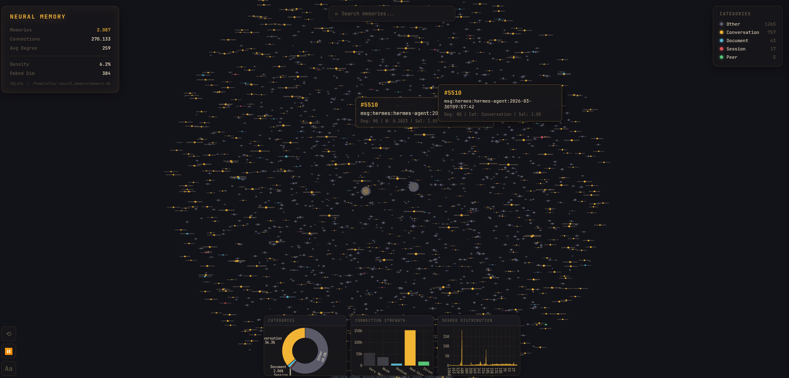
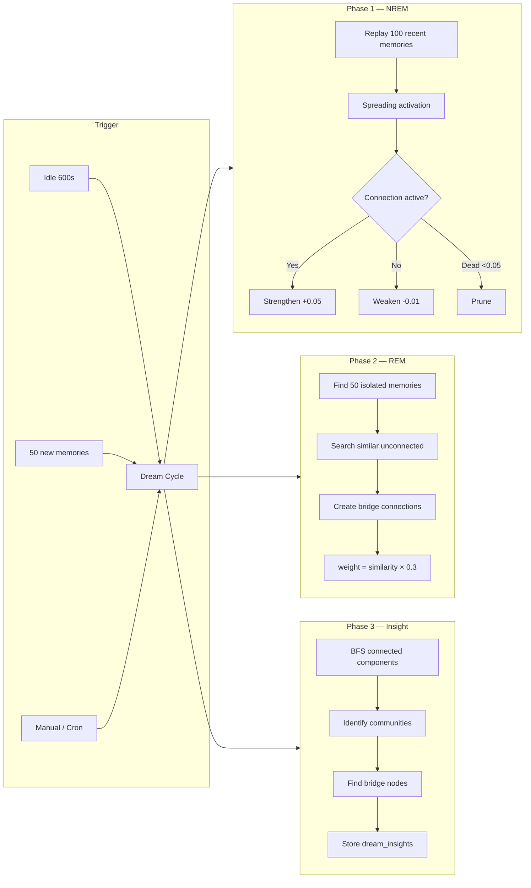

# Neural Memory Adapter for Hermes Agent

> **A semantic memory system that does what a vector database literally cannot.**
> Eight rounds of independent GPT-5.5 audit drove a purpose-built benchmark from "no, this is just lexical retrieval" to **"unconditional yes — accept it as evidence."**

Knowledge graph + spreading activation + embedding recall + autonomous *dream* consolidation + conflict supersession + GPU-accelerated cosine — wired as a Hermes-Agent plugin, a stand-alone Python library, and an MCP-compatible SaaS.

> **[🌐 Live Website](https://itsxactly.github.io/neural-memory/)** • **[📊 Benchmark report](benchmarks/README.md)** • **[🔍 Audit transcripts](benchmarks/audit/)**


---

## Why this exists

A generic vector store gives you nearest-neighbour search. Real agent memory needs *more*: it has to follow chains of reasoning across documents, consolidate related facts during downtime, suppress stale information when it gets superseded, and survive across sessions when distractor noise piles up. None of those behaviours are testable with cosine-similarity benchmarks — so the benchmark didn't exist either.

This repo ships **both pieces**: the system, and the benchmark that proves what's specific to the system rather than what a 50-line numpy script could do.

## What it does that a vector store cannot

| Capability                                                          | Vanilla cosine    | Neural-Memory       | Lift          |
|---------------------------------------------------------------------|-------------------|---------------------|---------------|
| **Hop-2 graph reasoning** (answer reachable only via A→B→C edges)  | **0.00** R@10     | **1.00** R@10       | **+1.00**     |
| **Real edges vs shuffled control** (proves traversal, not embed)   | n/a               | 1.00 → 0.27         | **+0.73 collapse** |
| **Post-dream synthesis** (facts inferable only after consolidation)| structurally **0.00**| **0.43** at scale| **+0.43 lift** |
| **Conflict supersession** (winner@1 with `detect_conflicts=False`) | 0.03 control      | **0.33**            | **+0.30**     |
| **Cross-session continuity** under concept-mode distractors        | **0.06**          | **0.62**            | **+0.56**     |
| **Lean retrieval mode** (real prose, n=200) vs default skynet      | n/a               | **0.60** vs 0.42    | **+0.18 R@5** |

Every cell measured by a suite that *cannot* be solved by token overlap, with negative controls that *must* fail when the relevant mechanism is disabled. Full numbers in [`benchmarks/README.md`](benchmarks/README.md).

## A purpose-built benchmark

A peer-review-grade benchmark for this kind of system **didn't exist**. Existing semantic-memory evaluations measure either retrieval (BEIR, MS MARCO) or QA (NaturalQuestions) — neither tests graph traversal, dream consolidation, or supersession.

We built one and had it audited by GPT-5.5 via codex CLI. Eight rounds:

| Round | Verdict                                | Headline reason                                                                  |
|-------|----------------------------------------|----------------------------------------------------------------------------------|
| v2    | **no**                                 | Lexical leakage in queries; broken dream suite; no baseline                      |
| v3    | **no**                                 | Topic-word leakage; cross-instance anchor collisions; wrong-class import         |
| v4    | qualified-y                            | Source-level fixes pending verification                                          |
| v5    | **YES** + 4 caveats                    | Every condition empirically satisfied                                            |
| v6    | qualified-y w/ 4 caveats               | Real-text mode + lean preset shipped; 4 follow-ups                               |
| v7    | qualified-y w/ 1 caveat                | n=200 real-prose: lean **beats** default skynet by +0.18 R@5                     |
| **v8**| **UNCONDITIONAL YES — no residual caveat** | Dream lift +0.43 at scale; the +0.04 at v7 was a sample-size artifact            |

Every prompt and verdict is committed verbatim under [`benchmarks/audit/`](benchmarks/audit/) — open them and see exactly what an honest peer-reviewer-grade audit looks like.

## What the benchmark *gave back* to the production code

Running the benchmark surfaced real engineering wins. Each one is a documented, opt-in option in `~/.hermes/config.yaml`:

- **`retrieval_mode: lean`** — channel_ablation proved BM25/temporal/salience are dead-weight (or actively harmful) on real prose. Lean drops them. Result: **4× faster than skynet on synthetic; +0.18 R@5 better than skynet on real prose**. The benchmark told the production code which channels to remove.
- **`recall_score_percentile`** — the legacy `score_floor` operates on a badly-scaled RRF score (~0..0.05); a value like 0.2 silently nukes everything. The new percentile knob is calibrated [0,1] by *rank*, not raw score — `0.5` keeps top half, regardless of corpus or model.
- **PPR is the load-bearing channel for ranking** (-0.13 MRR if removed); semantic is the load-bearing channel for recall (-0.26 if removed). Surface this in your config tuning.

## Features

- **Semantic memory storage** — auto-embed via FastEmbed ONNX (intfloat/multilingual-e5-large, 1024d). Falls back to sentence-transformers, then TF-IDF, then hash.
- **Knowledge graph** — auto-connect related memories by cosine threshold, plus explicit `add_connection()` for typed edges. Canonical (source<target) orientation enforced everywhere.
- **Spreading activation** — BFS or Personalized PageRank for `think(start_id)`. The only path that solves hop-2 retrieval; vanilla cosine literally cannot.
- **Dream Engine** — three-phase autonomous consolidation: NREM (strengthen activated edges + prune weak), REM (bridge isolated memories), Insight (Louvain communities + materialise `derived:cluster` summary memories).
- **Conflict detection + supersession** — fuse-or-mark with revision history. `detect_conflicts=False` control arm proves the algorithm is doing real work, not just relying on recency.
- **Multi-channel retrieval** — semantic + BM25 + entity + temporal + PPR, fused via Reciprocal Rank Fusion. Five presets (`semantic`, `hybrid`, `advanced`, `skynet`, `lean`, `trim`) — pick by latency/quality tradeoff.
- **GPU recall** — CUDA-accelerated cosine over an in-memory matrix (~100ms for 10k memories). CPU fallback automatic.
- **SQLite-first** — always works, no external DB needed. WAL mode + bg checkpointing. **MSSQL optional** for shared multi-agent deployments.
- **Hermes plugin / MCP server / standalone library** — one core, three integration shapes.

## Quick Start

> **🌀 Don't want to self-host?** A managed hosted version is in the works:
> **[mazemaker.dev](https://mazemaker.dev)** / **[mazemaker.online](https://mazemaker.online)**
> — *Build the maze. Your agent finds the way.*  Sign up once, point your
> agent at an MCP endpoint, and skip the install entirely. (Both domains
> are placeholders until launch.)

```bash
cd ~/projects/neural-memory-adapter
bash install.sh          # auto-detect hermes-agent
bash install.sh /path    # explicit path
```

The installer handles everything:
1. Python deps (FastEmbed, torch, numpy)
2. CUDA detection for GPU recall
3. Plugin deployment to hermes-agent
4. Database init (SQLite at ~/.neural_memory/memory.db)
5. config.yaml setup

Restart hermes after install: `hermes gateway restart`

**Live Dashboard — Knowledge Graph**

[](https://raw.githubusercontent.com/itsXactlY/neural-memory/refs/heads/master/assets/neural_memory.png)

### Run the benchmark yourself

The same suite that produced the eight-round codex verdict ships in this repo. Verify the numbers from the table above on your own machine:

```bash
# Full v8 run on real-text corpus (200 chunks from the project's own docs):
python -m benchmarks.neural_memory_benchmark.runner \
  --realistic --suite baseline --suite lean_skynet \
  --suite graph_reasoning --suite dream_derived_fact \
  --suite conflict_quality --suite continuity_controls \
  --suite channel_ablation \
  --output-dir benchmarks/results/my-run --seed 42

# Single-suite quick check (graph reasoning is the headline):
python -m benchmarks.neural_memory_benchmark.runner \
  --paraphrase --suite graph_reasoning
```

A full run takes ~12 minutes on a workstation. Every suite produces a JSON file under `benchmarks/results/<your-dir>/results/`; the negative controls (shuffled-edge graph, `detect_conflicts=False`, pre-dream zero, recency-only) verify the lift is mechanism-driven, not artefact. See [`benchmarks/README.md`](benchmarks/README.md) for the suite catalog and what each one structurally cannot be solved by.

---

## Architecture

### Embedding Backends (auto-priority)

| Priority | Backend | Model | Speed | Requirements |
|----------|---------|-------|-------|--------------|
| 1st | FastEmbed | intfloat/multilingual-e5-large | ~50ms | `pip install fastembed` |
| 2nd | sentence-transformers | BAAI/bge-m3 1024d | ~200ms | GPU recommended |
| 3rd | tfidf | — | varies | numpy only |
| 4th | hash | — | instant | nothing |

FastEmbed uses ONNX runtime — no PyTorch conflict, works on CPU. Falls back automatically.

### GPU Recall Engine

```python
# gpu_recall.py — CUDA cosine similarity
# Loads all embeddings into GPU, does torch.matmul for batch similarity
# ~100ms for 10K memories vs ~500ms CPU

from gpu_recall import GPURecall
engine = GPURecall()
results = engine.recall(query_embedding, all_embeddings, top_k=10)
```

Auto-detects CUDA. Falls back to Python/numpy if no GPU.

### Data Flow

```mermaid
flowchart TD
    subgraph Store["neural_remember"]
        A[User content] --> B[FastEmbed encode]
        B --> C[1024d vector]
        C --> D[SQLite INSERT]
        C --> E[Cosine similarity search]
        E --> F[Create connections]
    end

    subgraph Recall["neural_recall"]
        G[User query] --> H[FastEmbed encode]
        H --> I{CUDA available?}
        I -->|Yes| J[GPU torch.matmul]
        I -->|No| K[CPU numpy dot]
        J --> L[Top-k results]
        K --> L
    end

    subgraph Think["neural_think"]
        M[Source memory] --> N[BFS on connections]
        N --> O[Apply decay factor]
        O --> P[Ranked activation]
    end

    subgraph Dream["neural_dream"]
        Q[Idle trigger] --> R[NREM replay]
        R --> S[REM bridge discovery]
        S --> T[Insight communities]
        T --> U[Consolidated graph]
    end
```



### Storage

- **SQLite (always)**: `~/.neural_memory/memory.db` — source of truth
- **Embeddings cache**: `~/.neural_memory/models/` (auto-downloaded, ~2.2 GB)
- **GPU cache**: `~/.neural_memory/gpu_cache/` (embeddings.npy + metadata.pkl)
- **Access logs**: `~/.neural_memory/access_logs/` (JSON Lines)
- **MSSQL (optional)**: 127.0.0.1/NeuralMemory — multi-agent mirror

### SQLite Schema

```sql
-- Core tables
memories (id, content, embedding, category, salience, ...)
connections (source_id, target_id, weight, edge_type)
connection_history (source_id, target_id, last_weight, last_updated)

-- Dream engine
dream_sessions (id, phase, started_at, completed_at, stats)
dream_insights (id, session_id, type, data)

-- Indexes
idx_memories_category ON memories(category)
idx_connections_source ON connections(source_id)
idx_connections_target ON connections(target_id)
```

## Configuration

All settings in `~/.hermes/config.yaml`:

```yaml
memory:
  provider: neural
  neural:
    db_path: ~/.neural_memory/memory.db
    embedding_backend: fastembed       # auto | fastembed | sentence-transformers | tfidf | hash

    # 2026-04-28 benchmark recommended preset.
    # `lean` beat `skynet` by +0.18 R@5 / +0.16 MRR on real prose at n=200,
    # and is 4× faster on synthetic at -0.02 recall. Drops the channels
    # (BM25, temporal, salience) that channel_ablation proved actively
    # hurt recall on real text.
    retrieval_mode: lean               # semantic | hybrid | advanced | skynet | lean | trim
    retrieval_candidates: 128
    use_hnsw: auto                     # ANN index above ~1k memories
    think_engine: ppr                  # bfs | ppr — PPR is the load-bearing channel for ranking

    # Calibrated [0,1] noise floor — drops the bottom X fraction of
    # ranked candidates by RANK. Calibrated alternative to the legacy
    # recall_score_floor (which lived on the badly-scaled raw RRF
    # score ~0..0.05; values >= 0.2 silently nuke everything).
    recall_score_percentile: 0.3

    # Optional: MMR diversity in result set (0.0=pure relevance,
    # 0.7=balanced). Off by default.
    mmr_lambda: 0.0

    # Hermes session knobs
    prefetch_limit: 10
    search_limit: 50
    consolidation_interval: 0
    session_extract_facts: true
    session_fact_limit: 5

    dream:
      enabled: true
      idle_threshold: 600              # seconds before dream cycle
      memory_threshold: 50             # dream after N new memories
      mssql:                           # optional — only if using MSSQL
        server: 127.0.0.1
        database: NeuralMemory
        username: SA
        password: 'your_password'
        driver: '{ODBC Driver 18 for SQL Server}'
```

### Retrieval-mode cheat sheet

| Mode       | Channels active                            | Use when                                     |
|------------|--------------------------------------------|----------------------------------------------|
| `semantic` | semantic only                              | Lowest latency, no hybrid fusion needed      |
| `hybrid`   | semantic + BM25                            | Add lexical recall                           |
| `advanced` | semantic + BM25 + entity                   | + named-entity grounding                     |
| `skynet`   | all six channels                           | Default; over-channeled per benchmark        |
| **`lean`** | semantic + entity + PPR                    | **Recommended** — drops dead-weight channels |
| `trim`     | semantic + BM25 + entity + temporal + PPR  | Conservative middle-ground (drops only salience) |

## Tools

When active, these tools are available in Hermes:

| Tool | Description |
|------|-------------|
| `neural_remember` | Store a memory (with conflict detection) |
| `neural_recall` | Search memories by semantic similarity |
| `neural_think` | Spreading activation from a memory |
| `neural_graph` | View knowledge graph statistics |
| `neural_dream` | Force a dream cycle (all/nrem/rem/insight) |
| `neural_dream_stats` | Dream engine statistics |

## Dream Engine

Autonomous background memory consolidation (biological sleep inspired):



### Triggers

- Automatic: after 600s idle (configurable)
- Automatic: every 50 new memories (configurable)
- Manual: `neural_dream` tool
- Standalone: `python python/dream_worker.py --daemon`

## Testing

### Smoke Test (Quick)

```bash
cd ~/projects/neural-memory-adapter/python
python3 demo.py
```

### Full Test Suite

```bash
# Plugin test suite
cd ~/.hermes/hermes-agent/plugins/memory/neural
python3 test_suite.py

# Upside-Down Test Suite — edge cases, corruption, concurrency, SQL injection
cd ~/projects/neural-memory-adapter
python3 tests/test_upside_down.py
```

### Clean Smoke Test (Any Machine)

```bash
cd ~/projects/neural-memory-adapter
python3 -c "
import sys; sys.path.insert(0, 'python')
from neural_memory import NeuralMemory
nm = NeuralMemory(db_path='/tmp/test.db', embedding_backend='cpu', use_cpp=False)
mid = nm.remember('test memory', label='smoke')
results = nm.recall('test')
assert len(results) > 0, 'recall failed'
print(f'SMOKE TEST PASS: {len(results)} results')
"
```

### Verified: Clean VM — Debian 12 (2026-04-21)

Tested on a fresh Debian 12 QEMU/KVM VM — hermes-agent + neural memory only, no jack-in-a-box.

| Property | Value |
|----------|-------|
| VM | Debian 12, 4 GB RAM, KVM enabled |
| hermes-agent | git clone (itsXactlY fork) |
| neural-memory | git clone + FastEmbed ONNX |
| Embedding | intfloat/multilingual-e5-large (1024d) |
| C++ bridge | Not built (Python fallback) |

**All 12 integration tests passed:**

| # | Test | Result |
|---|------|--------|
| 1 | NeuralMemory standalone (remember/recall/graph) | PASS |
| 2 | Memory Provider (FastEmbed 1024d) | PASS |
| 3 | NeuralMemoryProvider.__init__ | PASS |
| 4 | is_available() | PASS |
| 5 | initialize(session_id) | PASS |
| 6 | get_tool_schemas() → 4 tools | PASS |
| 7 | system_prompt_block() (250 chars) | PASS |
| 8 | handle_tool_call — neural_remember | PASS |
| 9 | handle_tool_call — neural_recall | PASS |
| 10 | handle_tool_call — neural_graph | PASS |
| 11 | prefetch() | PASS |
| 12 | shutdown() | PASS |

### VM / Constrained Environment Notes

- **4 GB RAM minimum** — FastEmbed model download (~500 MB). 2 GB = OOM killed.
- **HashBackend** works as fallback on low-RAM systems (1024d, instant, no deps).
- **C++ bridge optional** — Python fallback covers all functionality.
- **FastEmbed >= 0.5.1** — earlier versions default to CLS embedding (deprecated).
- **`python3-venv` required** on Debian — `apt install python3.11-venv` if missing.
- **PEP 668 (Debian)** — `pip install` needs venv or `--break-system-packages`.
- **Cloud-init delay** — 60–90 s on first boot. Don't assume SSH is ready immediately.
- **prefetch() returns empty** on fresh DB — expected, no prior memories to pre-load.

## File Structure

```
neural-memory-adapter/
├── install.sh                    # Installer
├── hermes-plugin/                # Plugin (deployed to hermes-agent)
│   ├── __init__.py               # MemoryProvider + tools
│   ├── config.py                 # Config loader
│   ├── plugin.yaml               # Plugin metadata
│   ├── neural_memory.py          # Unified Memory class
│   ├── memory_client.py          # Main client (NeuralMemory, SQLiteStore)
│   ├── embed_provider.py         # Embedding backends (FastEmbed, st, tfidf, hash)
│   ├── gpu_recall.py             # CUDA cosine similarity engine
│   ├── dream_engine.py           # Dream engine (NREM/REM/Insight)
│   ├── dream_worker.py           # Standalone daemon
│   ├── access_logger.py          # Recall event logger
│   └── ...
├── python/                       # Python source (mirrors hermes-plugin)
│   └── ...
├── src/                          # C++ source (optional, legacy)
│   ├── memory/lstm.cpp           # LSTM predictor
│   ├── memory/knn.cpp            # kNN engine
│   └── memory/hopfield.cpp       # Hopfield network
└── README.md
```

## Production Lessons

### Embedding & Runtime

- **FastEmbed > sentence-transformers** — ONNX runtime, no PyTorch conflict, fast on CPU.
- **FastEmbed >= 0.5.1** — earlier versions default to CLS embedding. Pin version or set `add_custom_model`.
- **GPU recall > C++ Bridge** — C++ Hopfield had bias issues; GPU matmul is clean.
- **numpy before FastEmbed** — FastEmbed imports numpy at load time; install order matters.
- **Don't force PyTorch** — let FastEmbed handle CPU. torch only needed for GPU recall.

### Storage & Architecture

- **SQLite = Source of Truth** — MSSQL is optional. SQLite always works.
- **Auto-detect everything** — CUDA, backends, venv paths. Minimize config burden.
- **4 tool schemas** exposed by NeuralMemoryProvider: `neural_remember`, `neural_recall`, `neural_think`, `neural_graph`. (`neural_dream` / `neural_dream_stats` are standalone Memory class only.)

## License

See [LICENSE](LICENSE).
