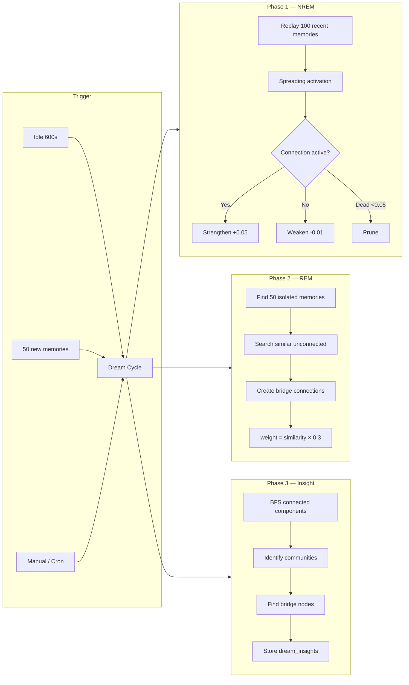

# Mazemaker — Persistent Memory for MCP Agents

> **Local MCP server that gives your AI a memory that sticks across sessions.**
> SQLite + GPU-accelerated recall under the hood. Runs offline. Consolidates while you sleep.


---

## In one minute

Your assistant forgets everything between chats. Mazemaker fixes that with a
local knowledge graph it can read and write through MCP.

```
You (Monday):  "we're on Postgres 16, schema lives in db/migrations"
You (3 weeks later, new session):  "which DB are we on again?"
Agent:         "Postgres 16 — schema in db/migrations. You mentioned this
                three weeks ago when we wired up the alembic step."
```

Four things make it different from "just another vector store":

- 🧠 **Graph, not search box** — facts link to facts. Ask about "the auth bug"
  and you also surface the file, the fix, and the decision behind it.
- 😴 **Idle consolidation** — every few hours of quiet, it strengthens what
  matters, prunes noise, and discovers new edges. *(This is the part most
  memory layers don't do.)*
- ✏️ **Supersession over duplication** — change your mind and the old fact
  gets marked obsolete with a pointer to the new one. No conflicting
  answers, no silent overwrites.
- 🔌 **MCP-native** — works with Hermes Agents and any MCP-compatible
  client. Standalone Python library too.

That's it. The rest of this README goes deeper the further you scroll.

> **🌀 Don't want to self-host?** A managed version is in private preview at
> **[mazemaker.dev](https://mazemaker.dev)** / **[mazemaker.online](https://mazemaker.online)**
> — point your agent at an MCP endpoint, done. *(Public launch: TBA.)*

---

## Why this exists

I tried the existing memory layers before writing my own. Two of them ended
the idea that this was a solved problem:

**Honcho ate my store. Twice.** Three days of recovery work the first time,
and a chunk of data is still gone. A memory system whose one job is
"don't forget" has exactly one failure mode it isn't allowed to have — and
Honcho had it on me twice. I wrote `python/import_honcho.py` so anyone
trying to leave can take their data with them.

**Mempalace was theater.** A memory product that mostly existed as marketing
collateral around a crypto launch — token went out, project went dark,
maintainers vanished. What's left in the repo is a benchmark exhibit, not
something you'd hand your assistant's working memory to.

That's why Mazemaker has two rules I won't trade away:

1. **Durability before cleverness.** SQLite in WAL mode. No distributed
   magic, no "eventually consistent" handwaving. Snapshots aren't in yet
   (on the roadmap). What you're seeing is Day-0 — the durability bones
   (WAL SQLite, atomic writes, the consolidation pattern) are lifted from
   trading infra I've run for years. If it holds under a market open,
   it'll hold here. New memories become **searchable on GPU before** the
   WAL commit completes — durability and searchability are on separate
   timelines, so one can't bottleneck the other.
2. **Supersession over score.** Correct a fact and the old one gets marked
   obsolete with a pointer to the replacement — not silently overwritten,
   not left to fight the new one at retrieval. This costs a few points on
   synthetic benchmarks where "right answer" means "latest wins by majority
   vote." Fine. Benchmarks aren't your assistant.

If you've been burned by a memory layer that broke or lied to you, this is
the one I wish had existed.

---

## How a `remember()` actually flows

Most memory layers go: write → embed → index → maybe-searchable-eventually.
Mazemaker's hot path is the other way around:

```
remember(text)
   ├─► embed via CUDA RPC (~180 ms, BGE-M3 on embed-server, no fallback)
   ├─► _gpu.add_one(vec)            ← appended to in-GPU tensor IMMEDIATELY
   ├─► searchable now (sub-5 ms recall on CUDA)
   └─► SQLite WAL write              ← durability, async to the hot path
```

The new memory is queryable on the GPU **before** the SQLite WAL has even
committed to disk. That's a deliberate inversion: durability lives on a
separate timeline from searchability, so neither has to wait for the
other.

If the GPU cache file ever vanishes (you `rm -rf ~/.neural_memory/gpu_cache/`,
the disk dies, whatever), the next gateway start rebuilds it from SQLite —
loudly, with logs at every step. No silent degradation, ever. Live trace
from the smoke test:

```
[INFO]    GPU recall ARMED: 2677 vectors on cuda
remember("...")
torch.Size([2677, 1024]) → torch.Size([2678, 1024])     # immediate, no rebuild
rm -rf ~/.neural_memory/gpu_cache/                       # simulate disaster
[WARNING] GPU recall cache absent — auto-building from ~/.neural_memory/memory.db
[INFO]    GPU recall ARMED post-build: 2678 vectors
```

### Latency budget (median per recall, today)

| Stage | Time | Notes |
|---|---:|---|
| BGE-M3 forward pass over Unix socket | ~180 ms | Dominates. Model swap on roadmap. |
| GPU kNN matmul + top-k | <5 ms | The actual "recall" |
| SQLite metadata fetch | ~10 ms | WAL read, no contention |
| Everything else | ~35 ms | RPC framing, post-processing |
| **Total** | **~230 ms** | End-to-end from `recall()` call to ranked list |

The 180 ms is where the optimization budget goes. Everything else is
already at or near the wall.

---

## Get it running

**Prereqs:** Python **3.11** exactly (3.12 was dropped from the test matrix —
Hermes is on 3.11), ~2 GB disk for the embedding model, writes to
`~/.neural_memory/`. GPU optional (auto-detected). Tested on a fresh
Debian 12 QEMU/KVM VM (4 GB RAM); see [Verified VM run](#verified-clean-vm--debian-12) below.

```bash
cd ~/projects/mazemaker
bash install.sh                 # auto-detect hermes-agent
bash install.sh /path           # explicit hermes-agent path
bash install.sh --hash-backend  # skip the 500 MB FastEmbed model (low-RAM hosts)
```

The installer figures out:

1. Python deps (FastEmbed ONNX, torch optional, numpy)
2. Whether you have a GPU (loud, no silent fallback at runtime)
3. Where to deploy the plugin (symlinks to `$HERMES_AGENT/plugins/...`)
4. Database init — SQLite at `~/.neural_memory/memory.db` (WAL on, bg checkpoint thread)
5. `~/.hermes/config.yaml` setup with the v8-benchmark-recommended preset

Restart hermes after install: `hermes gateway restart`.

That's the beginner path. If anything goes wrong, the
[Production Lessons](#production-lessons) section near the bottom has every
gotcha that's bitten me on a clean VM.

**Live Dashboard — Knowledge Graph**

[](https://raw.githubusercontent.com/itsXactlY/mazemaker/refs/heads/master/assets/neural_memory.png)

---

## Why it's different from "ChatGPT memory"

Most AI memory systems are search engines: type a query, get back the few
documents that contain the same words. That works for simple recall. It
falls apart for everything else an agent actually needs.

| Need                                                        | Search-engine memory | Mazemaker |
|-------------------------------------------------------------|----------------------|-----------|
| Find a fact you told it once                                | ✅                   | ✅        |
| Follow a chain of reasoning across multiple memories        | ❌                   | ✅        |
| Notice that two related facts should be connected           | ❌                   | ✅        |
| Replace a stale fact when you tell it the new one           | ❌                   | ✅        |
| Hold its ground when irrelevant noise piles up              | ❌                   | ✅        |
| Tell you *why* it surfaced a particular memory              | ❌                   | ✅        |

The right mental model isn't "vector database." It's **a small brain that
lives next to your agent.**

If you want the numbers behind those check marks, keep scrolling. If you
don't, the install above is enough — defaults are good.

---

## The numbers

A vector database with cosine similarity will do the first row of that
table well and fail every other row. We measured that explicitly.

| Capability                                                          | Vanilla cosine        | Mazemaker         | Lift               |
|---------------------------------------------------------------------|-----------------------|-------------------|--------------------|
| Hop-2 graph reasoning (answer reachable only via A→B→C edges)       | **0.00** R@10         | **1.00** R@10     | **+1.00**          |
| Real edges vs shuffled control (proves traversal, not embedding)    | n/a                   | 1.00 → 0.27       | **+0.73 collapse** |
| Post-dream synthesis (facts inferable only after consolidation)     | structurally **0.00** | **0.43** at scale | **+0.43 lift**     |
| Conflict supersession (winner@1 with `detect_conflicts=False`)      | 0.03 control          | **0.33**          | **+0.30**          |
| Cross-session continuity under concept-mode distractors             | **0.06**              | **0.62**          | **+0.56**          |
| Lean retrieval mode (real prose, n=200) vs default skynet           | n/a                   | **0.60** vs 0.42  | **+0.18 R@5**      |

R@10 = "the right answer is in the top-10 results", scored 0..1. Higher is
better. Every cell measured by a suite that *cannot* be solved by token
overlap, with negative controls (shuffled edges, supersession off,
pre-dream zero) that *must* fail when the relevant mechanism is disabled.

Full numbers, the JSON dumps, and the suite catalog:
[`benchmarks/README.md`](benchmarks/README.md).

---

## How we proved it (the audit story)

A peer-review-grade benchmark for this kind of system **didn't exist**.
Existing semantic-memory evaluations measure either retrieval (BEIR,
MS MARCO) or QA (NaturalQuestions) — none of them test graph traversal,
dream consolidation, or supersession.

So we built one, and had it independently audited by **GPT-5.5** (via
[codex CLI](https://openai.com/codex)). It pushed back hard. Eight rounds:

| Round | Verdict                                    | Headline reason                                                                  |
|-------|--------------------------------------------|----------------------------------------------------------------------------------|
| v2    | **no**                                     | Lexical leakage in queries; broken dream suite; no baseline                      |
| v3    | **no**                                     | Topic-word leakage; cross-instance anchor collisions; wrong-class import         |
| v4    | qualified-y                                | Source-level fixes pending verification                                          |
| v5    | **YES** + 4 caveats                        | Every condition empirically satisfied                                            |
| v6    | qualified-y w/ 4 caveats                   | Real-text mode + lean preset shipped; 4 follow-ups                               |
| v7    | qualified-y w/ 1 caveat                    | n=200 real-prose: lean **beats** default skynet by +0.18 R@5                     |
| **v8**| **UNCONDITIONAL YES — no residual caveat** | Dream lift +0.43 at scale; the +0.04 at v7 was a sample-size artifact            |

Every prompt and every verdict, from "no, this is just lexical retrieval"
to "unconditional yes — accept it as evidence", is committed verbatim
under [`benchmarks/audit/`](benchmarks/audit/). Open
`codex-v2-audit-2026-04-28.md` and `codex-v8-verdict-2026-04-28.md` side
by side to see the journey end-to-end.

---

## What the benchmark *gave back* to the production code

Running the benchmark wasn't just measurement. It surfaced real engineering
wins. Each one is now a documented, opt-in option in `~/.hermes/config.yaml`:

- **`retrieval_mode: lean`** — channel ablation proved that on real prose,
  BM25 / temporal / salience are dead-weight (or actively *harmful*). Lean
  drops them. Result: **4× faster than skynet on synthetic; +0.18 R@5
  better than skynet on real prose**. The benchmark told the production
  code which channels to remove.
- **`recall_score_percentile`** — the legacy `score_floor` operates on a
  badly-scaled internal score (~0..0.05); a sensible-looking value like
  0.2 silently nukes everything. The new percentile knob is calibrated
  [0,1] by *rank*, so `0.5` keeps top half regardless of corpus or model.
- **PPR is the load-bearing channel for ranking** (-0.13 MRR if removed);
  semantic is the load-bearing channel for recall (-0.26 if removed).
  Surface this in your config tuning.

Run the benchmark yourself:

```bash
# Full v8 run on real-text corpus (200 chunks from the project's own docs):
python -m benchmarks.neural_memory_benchmark.runner \
  --realistic --suite baseline --suite lean_skynet \
  --suite graph_reasoning --suite dream_derived_fact \
  --suite conflict_quality --suite continuity_controls \
  --suite channel_ablation \
  --output-dir benchmarks/results/my-run --seed 42

# Single-suite quick check (graph reasoning is the headline):
python -m benchmarks.neural_memory_benchmark.runner \
  --paraphrase --suite graph_reasoning
```

A full run takes ~12 minutes on a workstation. Every suite produces a
JSON file under `benchmarks/results/<your-dir>/results/`.

---

## Features (technical bullets)

If the install + the cheat sheet above is enough for you, you can stop
reading here. Below this line everything gets progressively more technical.

- **Semantic memory storage** — auto-embed via FastEmbed ONNX
  (intfloat/multilingual-e5-large, 1024d) on CPU, or BGE-M3 over a
  CUDA-pinned embed-server for GPU. Falls back to sentence-transformers,
  then TF-IDF, then deterministic hash. **No silent device fallback** at
  runtime — if you asked for CUDA and it isn't there, you get a loud error.
- **Knowledge graph** — auto-connect related memories by cosine threshold,
  plus explicit `add_connection()` for typed edges. Canonical
  (source<target) orientation enforced everywhere.
- **Spreading activation** — BFS or Personalized PageRank for
  `think(start_id)`. The only path that solves hop-2 retrieval; vanilla
  cosine literally cannot.
- **Dream Engine** — three-phase autonomous consolidation: NREM
  (strengthen activated edges + prune weak), REM (bridge isolated
  memories), Insight (Louvain communities + materialise `derived:cluster`
  summary memories).
- **Conflict detection + supersession** — fuse-or-mark with revision
  history. `detect_conflicts=False` control arm proves the algorithm is
  doing real work, not just relying on recency.
- **Multi-channel retrieval** — semantic + BM25 + entity + temporal + PPR,
  fused via Reciprocal Rank Fusion. Six presets (`semantic`, `hybrid`,
  `advanced`, `skynet`, `lean`, `trim`).
- **GPU recall** — CUDA-accelerated cosine over an in-GPU tensor with
  `add_one()` hot-path appends. Sub-5 ms median on 10k+ memories.
  Auto-rebuilds cache from SQLite on next start if `gpu_cache/` is
  missing or corrupted — loudly, with `[WARNING]` logs.
- **SQLite-first** — always works, no external DB needed. WAL mode +
  bg checkpoint thread every 60 s. **Postgres + pgvector optional** for
  shared multi-agent / Pro-tier deployments (set `MM_DB_BACKEND=postgres`).
- **Hermes plugin / MCP server / standalone library** — one core, three
  integration shapes.
- **Migration tools** — `import_honcho.py` and `import_hindsight.py` get
  your data out of the systems you're trying to leave.

---

## Architecture

### Embedding Backends (auto-priority)

| Priority | Backend                | Model                               | Speed      | Requirements                       |
|----------|------------------------|-------------------------------------|------------|------------------------------------|
| 1st      | FastEmbed (ONNX, CPU)  | intfloat/multilingual-e5-large      | ~50 ms     | `pip install fastembed`            |
| 2nd      | embed-server (GPU)     | BAAI/bge-m3 (1024d)                 | ~180 ms    | CUDA + Unix-socket RPC, no fallback |
| 3rd      | sentence-transformers  | configurable                        | ~200 ms    | torch (large)                      |
| 4th      | tfidf                  | —                                   | varies     | numpy only                         |
| 5th      | hash                   | —                                   | instant    | nothing                            |

FastEmbed uses ONNX runtime — no PyTorch conflict, works on CPU. The
GPU path runs over a Unix socket to a long-lived embed-server process,
which is what dominates the 230 ms recall latency (see budget above).

### GPU Recall Engine

```python
# python/gpu_recall.py — CUDA cosine similarity
# All embeddings live in a pinned GPU tensor; recall is one matmul.
# Hot-path add_one() appends new vectors immediately — no rebuild.

from gpu_recall import GpuRecallEngine
engine = GpuRecallEngine()                # auto-builds cache from SQLite if missing
engine.add_one(new_id, new_vec)           # appended to in-GPU tensor; searchable now
results = engine.recall(query_vec, k=10)  # sub-5 ms on cuda
```

No silent fallback. If you asked for `cuda` and CUDA isn't there, you
get a loud error, not slow CPU answers wearing a GPU hat. This was the
first hard lesson from running other memory layers — the ones that
"just kept working" were quietly serving from a fallback path nobody
could see.

### Data Flow

```mermaid
flowchart TD
    subgraph Store["mazemaker_remember (hot path)"]
        A[User content] --> B[embed-server CUDA RPC]
        B --> C[1024d vector]
        C --> X[GpuRecallEngine.add_one]
        X --> Y[searchable on GPU]
        C --> D[SQLite WAL write]
        D --> F[Auto-connect by cosine]
    end

    subgraph Recall["mazemaker_recall"]
        G[User query] --> H[embed-server encode]
        H --> I[GPU torch.matmul]
        I --> L[Top-k results]
    end

    subgraph Think["mazemaker_think"]
        M[Source memory] --> N[BFS or PPR on connections]
        N --> O[Apply decay factor]
        O --> P[Ranked activation]
    end

    subgraph Dream["mazemaker_dream"]
        Q[Idle trigger] --> R[NREM replay]
        R --> S[REM bridge discovery]
        S --> T[Insight communities]
        T --> U[Consolidated graph]
    end
```



### Storage

- **SQLite (always)**: `~/.neural_memory/memory.db` — source of truth.
  WAL mode, `synchronous=NORMAL`, `wal_autocheckpoint=100000`,
  background checkpoint thread every 60 s.
- **Embedding cache**: `~/.neural_memory/models/` (auto-downloaded, ~2.2 GB).
- **GPU cache**: `~/.neural_memory/gpu_cache/` (embeddings.npy + metadata.pkl).
  Auto-rebuilt from SQLite if missing on next gateway start.
- **Access logs**: `~/.neural_memory/access_logs/` (JSON Lines).
- **Postgres + pgvector (optional)**: enabled via `MM_DB_BACKEND=postgres` —
  graph + cold-storage mirror for shared multi-agent deployments.
  Credentials in `~/.hermes/.env` as `MM_POSTGRES_DSN` (preferred) or the
  discrete `MM_POSTGRES_HOST/PORT/DB/USER/PASSWORD` vars.

### SQLite Schema

```sql
-- Core tables
memories (id, content, embedding, category, salience, ...)
connections (source_id, target_id, weight, edge_type)
connection_history (source_id, target_id, last_weight, last_updated)

-- Dream engine
dream_sessions (id, phase, started_at, completed_at, stats)
dream_insights (id, session_id, type, data)

-- Indexes
idx_memories_category ON memories(category)
idx_connections_source ON connections(source_id)
idx_connections_target ON connections(target_id)
```

---

## Configuration (every knob)

All settings in `~/.hermes/config.yaml`. The defaults below are the
recommended preset based on the v8 benchmark.

```yaml
memory:
  provider: neural
  neural:
    db_path: ~/.neural_memory/memory.db
    embedding_backend: fastembed       # auto | fastembed | sentence-transformers | tfidf | hash

    # 2026-04-28 benchmark recommended preset.
    # `lean` beat `skynet` by +0.18 R@5 / +0.16 MRR on real prose at n=200,
    # and is 4× faster on synthetic at -0.02 recall. Drops the channels
    # (BM25, temporal, salience) that channel_ablation proved actively
    # hurt recall on real text.
    retrieval_mode: lean               # semantic | hybrid | advanced | skynet | lean | trim
    retrieval_candidates: 128
    use_hnsw: auto                     # ANN index above ~1k memories
    think_engine: ppr                  # bfs | ppr — PPR is the load-bearing channel for ranking

    # Calibrated [0,1] noise floor — drops the bottom X fraction of
    # ranked candidates by RANK. Calibrated alternative to the legacy
    # recall_score_floor (which lived on the badly-scaled raw RRF
    # score ~0..0.05; values >= 0.2 silently nuke everything).
    recall_score_percentile: 0.3

    # Optional: MMR diversity in result set (0.0=pure relevance,
    # 0.7=balanced). Off by default.
    mmr_lambda: 0.0

    # Hermes session knobs
    prefetch_limit: 10
    search_limit: 50
    consolidation_interval: 0
    session_extract_facts: true
    session_fact_limit: 5

    dream:
      enabled: true
      idle_threshold: 600              # seconds before dream cycle
      memory_threshold: 50             # dream after N new memories
    # To enable the Postgres + pgvector mirror, set MM_DB_BACKEND=postgres
    # and supply MM_POSTGRES_DSN (or the discrete MM_POSTGRES_* vars).
```

### Retrieval-mode cheat sheet

| Mode       | Channels active                            | Use when                                         |
|------------|--------------------------------------------|--------------------------------------------------|
| `semantic` | semantic only                              | Lowest latency, no hybrid fusion needed          |
| `hybrid`   | semantic + BM25                            | Add lexical recall                               |
| `advanced` | semantic + BM25 + entity                   | + named-entity grounding                         |
| `skynet`   | all six channels                           | Default; over-channeled per benchmark            |
| **`lean`** | semantic + entity + PPR                    | **Recommended** — drops dead-weight channels     |
| `trim`     | semantic + BM25 + entity + temporal + PPR  | Conservative middle-ground (drops only salience) |

### Tunable env vars

Most of these you won't touch. They exist when you need them:

| Env var                            | Default        | What it does                                   |
|------------------------------------|----------------|------------------------------------------------|
| `MM_DB_BACKEND`                    | (sqlite)       | Set to `postgres` to enable the pgvector mirror |
| `MM_POSTGRES_DSN`                  | —              | Full Postgres DSN (preferred over discrete)     |
| `MM_POSTGRES_HOST/PORT/DB/USER/PASSWORD` | localhost defaults | Discrete creds; `MM_POSTGRES_PASSWORD` is required |
| `EMBED_MODEL`                      | `BAAI/bge-m3`  | embed-server model id                          |
| `EMBED_DEVICE`                     | auto           | Force `cuda` / `cpu`; no silent fallback       |
| `EMBED_GPU_WAIT_S`                 | `30`           | Wait this long for GPU memory before erroring  |
| `EMBED_IDLE_TIMEOUT`               | `20`           | Idle seconds before embed-server unloads       |
| `EMBED_SOCKET`                     | cache-dir      | Unix-socket path for the embed RPC             |
| `NEURAL_MEMORY_EMBEDDING_BACKEND`  | `auto`         | Override the priority chain                    |
| `NEURAL_MEMORY_RETRIEVAL_MODE`     | `hybrid`       | Same as `retrieval_mode` in config.yaml        |
| `NEURAL_MEMORY_USE_HNSW`           | `auto`         | Toggle HNSW index                              |
| `NEURAL_MEMORY_LAZY_GRAPH`         | `true`         | Defer graph load until first query             |
| `NEURAL_MEMORY_THINK_ENGINE`       | `ppr`          | `bfs` or `ppr`                                 |
| `NEURAL_MEMORY_RERANK`             | `false`        | Cross-encoder reranking on/off                 |
| `NEURAL_MEMORY_RERANK_MODEL`       | ms-marco-MiniLM | Reranker model id                              |

Resolution order is **OS env > `~/.hermes/.env` > `config.yaml` > defaults**.
Never paste passwords into `config.yaml` or source — keep them in `.env`
and `chmod 600` it.

---

## Tools (LLM-callable surface)

When the plugin is active, these tools appear in Hermes:

| Tool                  | Description                                  |
|-----------------------|----------------------------------------------|
| `neural_remember`     | Store a memory (with conflict detection)     |
| `neural_recall`       | Search memories by semantic similarity       |
| `neural_think`        | Spreading activation from a memory           |
| `neural_graph`        | View knowledge graph statistics              |
| `neural_dream`        | Force a dream cycle (all/nrem/rem/insight)   |
| `neural_dream_stats`  | Dream engine statistics                      |

---

## Dream Engine (deep dive)

Autonomous background memory consolidation, biological-sleep inspired:



### Triggers

- Automatic: after 600 s idle (configurable)
- Automatic: every 50 new memories (configurable)
- Manual: `neural_dream` tool
- Standalone: `python python/dream_worker.py --daemon`

---

## Migrating from another memory system

Two importers ship with Mazemaker so you don't arrive as an empty user:

```bash
# Honcho — point at an export directory
HONCHO_EXPORT_DIR=~/honcho_export python python/import_honcho.py

# Hindsight — talks to the cloud API directly (stdlib only, no SDK dep)
python python/import_hindsight.py --api-key $HINDSIGHT_API_KEY
python python/import_hindsight.py --api-key $HINDSIGHT_API_KEY --export-only  # JSON dump, no import
```

Both tools batch-embed on GPU and bulk-insert without auto-connect (the
graph is rebuilt by the next dream cycle, so you don't pay double for
edges that consolidation will produce anyway). Existing Mazemaker data
is preserved.

---

## Testing

### Smoke Test (Quick)

```bash
cd ~/projects/mazemaker/python
python3 demo.py
```

### Full Test Suite

```bash
# Plugin test suite
cd ~/.hermes/hermes-agent/plugins/memory/neural
python3 test_suite.py

# Upside-Down Test Suite — edge cases, corruption, concurrency, SQL injection
cd ~/projects/mazemaker
python3 tests/test_upside_down.py
```

### Clean Smoke Test (Any Machine)

```bash
cd ~/projects/mazemaker
python3 -c "
import sys; sys.path.insert(0, 'python')
from mazemaker import Memory
nm = Memory(db_path='/tmp/test.db', embedding_backend='hash', use_cpp=False)
mid = nm.remember('test memory', label='smoke')
results = nm.recall('test')
assert len(results) > 0, 'recall failed'
print(f'SMOKE TEST PASS: {len(results)} results')
"
```

### Verified: Clean VM — Debian 12 (2026-04-21)

Tested on a fresh Debian 12 QEMU/KVM VM — hermes-agent + mazemaker only,
no jack-in-a-box.

| Property      | Value                                              |
|---------------|----------------------------------------------------|
| VM            | Debian 12, 4 GB RAM, KVM enabled                   |
| hermes-agent  | git clone (itsXactlY fork)                         |
| mazemaker     | git clone + FastEmbed ONNX                         |
| Embedding     | intfloat/multilingual-e5-large (1024d)             |
| C++ bridge    | Not built (Python fallback)                        |

**All 12 integration tests passed:**

| #  | Test                                            | Result |
|----|-------------------------------------------------|--------|
| 1  | Mazemaker standalone (remember/recall/graph)    | PASS   |
| 2  | Memory Provider (FastEmbed 1024d)               | PASS   |
| 3  | NeuralMemoryProvider.__init__                   | PASS   |
| 4  | is_available()                                  | PASS   |
| 5  | initialize(session_id)                          | PASS   |
| 6  | get_tool_schemas() → 4 tools                    | PASS   |
| 7  | system_prompt_block() (250 chars)               | PASS   |
| 8  | handle_tool_call — neural_remember              | PASS   |
| 9  | handle_tool_call — neural_recall                | PASS   |
| 10 | handle_tool_call — neural_graph                 | PASS   |
| 11 | prefetch()                                      | PASS   |
| 12 | shutdown()                                      | PASS   |

---

## File Structure

```
mazemaker/
├── install.sh                    # Installer (--hash-backend for low-RAM hosts)
├── hermes-plugin/                # Plugin (deployed to hermes-agent via symlink)
│   ├── __init__.py               # MemoryProvider + tools
│   ├── config.py                 # Config loader
│   ├── plugin.yaml               # Plugin metadata
│   └── ...
├── python/                       # Python source (mirrored into hermes-plugin)
│   ├── mazemaker.py              # Public Memory facade
│   ├── memory_client.py          # Main client (Memory, SQLiteStore)
│   ├── embed_provider.py         # Embedding backends + embed-server RPC
│   ├── gpu_recall.py             # CUDA cosine + add_one hot path
│   ├── postgres_store.py         # Postgres + pgvector backend
│   ├── dream_postgres_store.py   # Dream engine on Postgres
│   ├── dream_engine.py           # Dream engine (NREM/REM/Insight)
│   ├── dream_worker.py           # Standalone daemon
│   ├── access_logger.py          # Recall event logger
│   ├── mazemaker_backup.py       # Online backup API
│   ├── import_honcho.py          # Migration: Honcho export → Mazemaker
│   ├── import_hindsight.py       # Migration: Hindsight Cloud → Mazemaker
│   └── ...
├── src/                          # C++ source (optional, legacy)
│   ├── memory/lstm.cpp           # LSTM predictor
│   ├── memory/knn.cpp            # kNN engine
│   └── memory/hopfield.cpp       # Hopfield network
├── benchmarks/                   # The eight-round audit story
│   ├── README.md                 # Suite catalog + headline numbers
│   ├── audit/                    # codex-v2..v8 prompts + verdicts (verbatim)
│   └── neural_memory_benchmark/  # Suites + dataset generators
└── README.md
```

---

## Production Lessons

Every entry here is something that bit me on a clean VM. Format is
**symptom → cause → fix** so you can ctrl-F your error and skip the prose.

### Install / Bootstrap

**Debian 12: install fails on `venv` creation.**
Cause: `python3-venv` isn't shipped with system Python. PEP 668 also
blocks `pip install` outside a venv on recent Debian/Ubuntu.
Fix: `apt install python3.11-venv` first. Installer flags this honestly
instead of pretending the next step will work.

**Install OOMs or stalls during model download.**
Cause: FastEmbed wants ~4 GB RAM headroom for the embedding model. VMs
under 3 GB will thrash or fail.
Fix: pass `--hash-backend` to `install.sh`. You skip the model entirely
(<50 MB total) and get a deterministic 1024d hash embedding instead.
Quality is worse than ONNX FastEmbed, but it works on a $5 VPS and
survives upgrades. The installer auto-detects RAM and switches to this
mode below 3 GB.

**Python 3.12: random import errors.**
Cause: 3.12 was dropped from the CI matrix — Hermes is on 3.11. Older
guides and copy-paste install snippets don't say so.
Fix: pin to **3.11 exactly**. `pyenv install 3.11` if your distro defaults
to 3.12.

**Cloud-init delay on first boot.**
Cause: 60–90 s before SSH is ready on most cloud providers.
Fix: don't assume the VM is up the moment provisioning returns. Sleep,
or poll the SSH port.

**`pip install` hangs on `torch` for ages.**
Cause: pip resolves CUDA wheels you don't need. FastEmbed runs on ONNX —
torch isn't on the hot path unless you want GPU recall.
Fix: don't force PyTorch. Let FastEmbed handle CPU. If you really need
torch, pre-install the CPU build:
`pip install torch --index-url https://download.pytorch.org/whl/cpu`.

### Database

**`database is locked` under concurrent agents.**
Cause: this is **expected SQLite behavior** under concurrent writes, not
a bug. WAL is on, reads don't block writes, but writes still serialize.
Fix: the call site needs to retry — Mazemaker doesn't auto-retry for you.
WAL config you'll see in `memory_client.py`:

```python
PRAGMA journal_mode=WAL
PRAGMA synchronous=NORMAL
PRAGMA wal_autocheckpoint=100000
```

Plus a background thread that runs `wal_checkpoint(TRUNCATE)` every 60 s.

**`memory.db-wal` grows without bound.**
Cause: the checkpoint thread died, or your write rate exceeds the
checkpoint cadence.
Fix: monitor `~/.neural_memory/memory.db-wal` size in production. If it
runs away, restart the gateway or run a manual checkpoint:
`sqlite3 ~/.neural_memory/memory.db 'PRAGMA wal_checkpoint(TRUNCATE);'`.
There is **no VACUUM** in the codebase yet — file size only shrinks via
checkpoints. On the roadmap.

### Backups

There's a working backup module at `python/mazemaker_backup.py`
(`NeuralMemoryBackup` — `.backup()`, `.restore()`, `.verify()`, keeps
the last 10). It's **opt-in**. Nothing calls it automatically. Until
that changes, wire it up yourself:

```bash
# daily cron — uses sqlite3 .backup under the hood, WAL-safe
python -m mazemaker_backup backup
# or, the brute-force equivalent:
sqlite3 ~/.neural_memory/memory.db \
  ".backup ~/.neural_memory/backups/$(date +%F).db"
```

**Don't `cp` a live WAL DB.** It works most of the time and breaks the
one time you needed it. Use `.backup` (which the module does for you)
or `sqlite3 .backup`.

### GPU / Embeddings

**No silent fallback, by design — at every layer.**
Both `embed_provider.py` and the `GpuRecallEngine` refuse to silently
degrade. If you asked for CUDA and CUDA isn't there, you get a loud
error, not slow CPU answers wearing a GPU hat. This was a deliberate
response to memory layers that "just keep working" while quietly serving
from a fallback path nobody can see.

**GPU detected at install but inference uses CPU.**
Cause: torch installed without CUDA, CUDA/driver mismatch, or the
embed-server isn't running on the GPU host you think it is.
Fix: `python -c "import torch; print(torch.cuda.is_available())"` should
return True. Also check the embed-server logs for `ARMED on cuda`.
If you actually want CPU, set `EMBED_DEVICE=cpu` or
`NEURAL_MEMORY_EMBEDDING_BACKEND=fastembed` explicitly — don't rely on
auto-detection to "do the right thing."

**`gpu_cache/` directory was deleted or got corrupted.**
Cause: disk wipe, accidental `rm`, partial restore, whatever.
Fix: nothing. Restart the gateway. The cache auto-rebuilds from SQLite
on next start with a loud `[WARNING] GPU recall cache absent —
auto-building from <db>` so you know what happened. Verified in the
smoke test, not theoretical.

**First query after restart takes 5–30 s.**
Cause: cold-loading BGE-M3 + GPU cache build (one-time per process).
Fix: not a bug. Once `[INFO] GPU recall ARMED: N vectors on cuda` shows
up in logs, you're warm. Recall median drops to ~230 ms, almost all of
which is the embedding forward pass, not the recall itself.

**CUDA OOM under high concurrency.**
Cause: each in-flight `recall()` queues an embedding forward pass on
the GPU. BGE-M3 is large.
Fix: monitor `nvidia-smi`. If you're saturating, the right answer is
queuing on the embed-server side, not adding fallback code that
pretends the GPU is fine. Model swap to a smaller multilingual encoder
is on the roadmap and will reduce this.

### Hermes Integration

**Plugin doesn't appear after install.**
Cause: hermes wasn't restarted, or restarted with a stale manifest cache.
Fix: `hermes gateway restart`, then `hermes plugin list`.

**Plugin loads, but tools silently vanish.**
Cause: the installer deploys the plugin as **symlinks**, not copies, to
two paths: `$HERMES_AGENT/plugins/memory/neural` and
`$HOME/.hermes/plugins/memory/neural`. If a symlink target moves or you
clean up the source repo, tool registration fails silently because the
Python import dies before MCP gets to register anything.
Fix: verify both symlinks resolve:
`ls -L $HERMES_AGENT/plugins/memory/neural/*.py` — every file should
exist. If any are broken, re-run `install.sh`.

**`prefetch()` returns empty on a fresh DB.**
Cause: nothing to prefetch — the DB is empty.
Fix: not a bug. Expected on first run.

### `.env` / Secrets

Credentials live in `~/.hermes/.env`. Resolution order: **OS env >
`.env` file > `config.yaml` > defaults**. Never paste passwords into
`config.yaml` or source.

For the optional Postgres + pgvector mirror you'll want either:

```
MM_POSTGRES_DSN=postgresql://user:pw@host:5432/mazemaker
```

…or the discrete vars (`MM_POSTGRES_HOST`, `MM_POSTGRES_PORT`,
`MM_POSTGRES_DB`, `MM_POSTGRES_USER`, `MM_POSTGRES_PASSWORD`).
If `MM_DB_BACKEND=postgres` is set but `MM_POSTGRES_PASSWORD` is missing,
the backend errors loudly at startup — no silent SQLite fallback.

`chmod 600 ~/.hermes/.env` and don't commit it.

### Benchmark-driven defaults

- **`retrieval_mode: lean` is the new recommended default** —
  channel_ablation at n=200 on real prose proved BM25/temporal/salience
  are dead-weight or actively harmful. Lean drops them. +0.18 R@5 vs
  skynet.
- **`recall_score_percentile` over `recall_score_floor`** — the legacy
  floor lives on a 0..0.05 scale and is silently broken for any
  reasonable user input. Percentile is calibrated [0,1] by rank.
- **`think_engine: ppr` over `bfs`** for ranking-quality runs —
  channel_ablation proved PPR is the biggest MRR contributor (-0.13 if
  removed).

---

Found a new gotcha? Open an issue with the symptom verbatim — that's how
this list grows.

---

## License

See [LICENSE](LICENSE).
